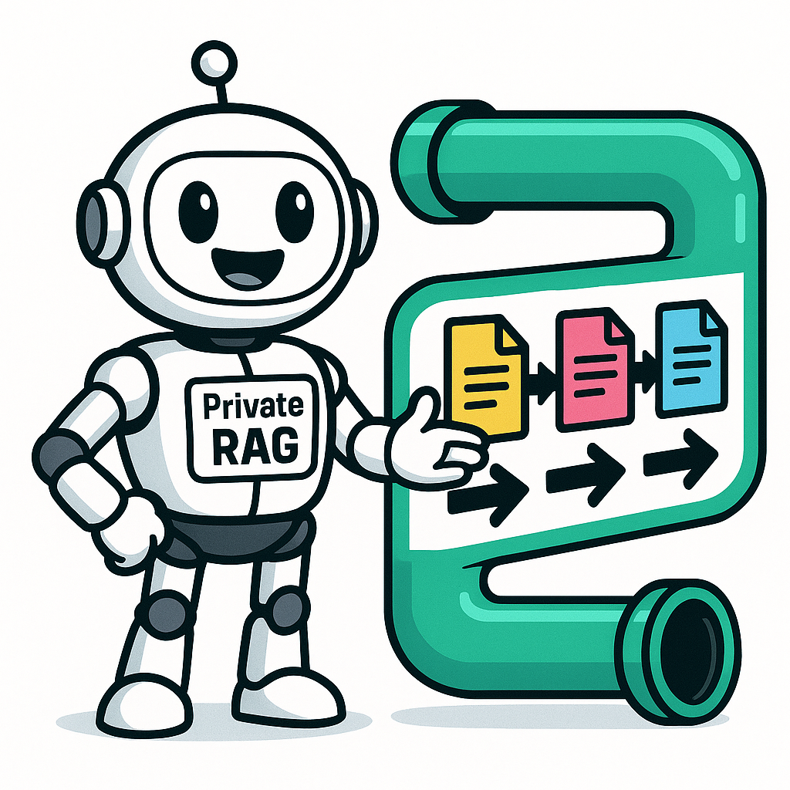

# Private RAG Deployment

This repository provides a live-scripting workflow for deploying a private RAG (Retrieval-Augmented Generation) system on AWS EC2. While RagFlow's basic setup uses public AI models, this self-hosted deployment enables individual tailoring of AI model usage, allowing seamless transition from public APIs to privately hosted AI models for enhanced privacy and control.

## About RagFlow

RagFlow is an open-source RAG (Retrieval-Augmented Generation) engine based on deep document understanding. It provides:

- Document parsing and ingestion from multiple formats
- Vector database integration for semantic search
- Large language model integration for question answering
- Web-based interface for knowledge base management
- API endpoints for programmatic access

For more information, see the [RagFlow GitHub repository](https://github.com/infiniflow/ragflow).

## Overview

RagFlow deployment uses Infrastructure as Code with Terraform to create an AWS environment. The workflow includes complete configuration and installation of required software tools. Appendices cover GitHub Runner setup and graphical user interface configuration.

## Features

- Self-hosted RAG system with local document processing for maximum privacy
- Flexible AI model integration: start with public APIs and transition to privately hosted models
- Production-ready setup with SSL/HTTPS and Docker containerization
- Advanced RAG capabilities for document ingestion, vector search, and knowledge base management
- Reproducible methodology using live-scripting workflow

## Prerequisites

- AWS account with appropriate permissions
- Local tools: Terraform, Git
- SSH key for EC2 access

## Quick Start

1. Clone this repository
2. Configure AWS credentials
3. Follow the live-scripting workflow in `private-rag.org`
4. Execute code blocks step-by-step for setting up your own ragflow environment

## Documentation

Full deployment instructions are in `private-rag.org`, an executable Org-mode document. Exportable to HTML or PDF for different formats.

## Project Structure

- `private-rag.org`: Main live-scripting documentation
- `terraform/`: Infrastructure as Code configuration
- `aw-org-html-themes/`: HTML export themes
- `StyleGuide.md`: Writing guidelines

## Usage Notes

- Code blocks execute directly in Emacs (F4 key) or copy to terminal
- Each step includes validation before proceeding
- Infrastructure costs accrue while EC2 instances run

## License

MIT