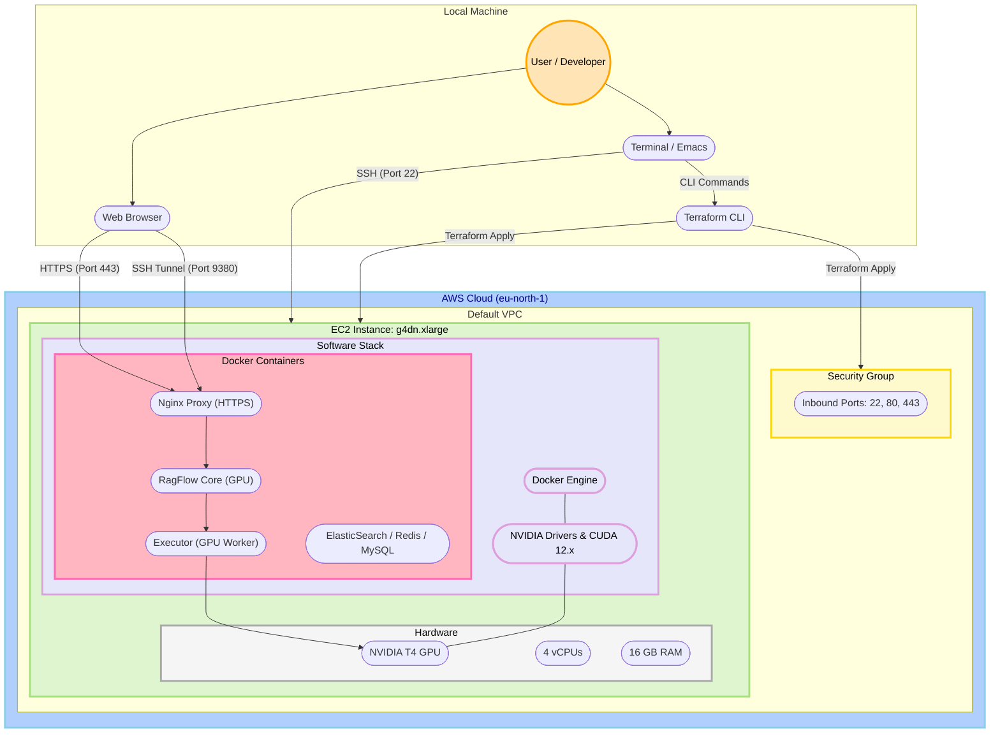
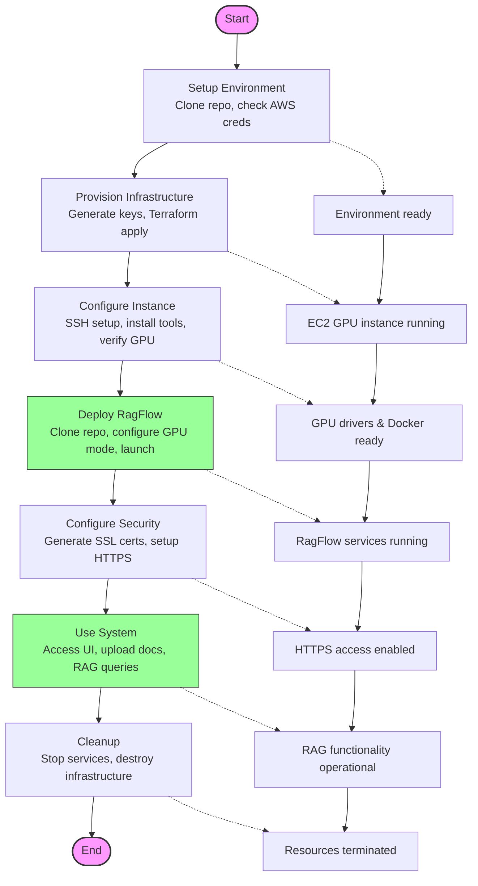
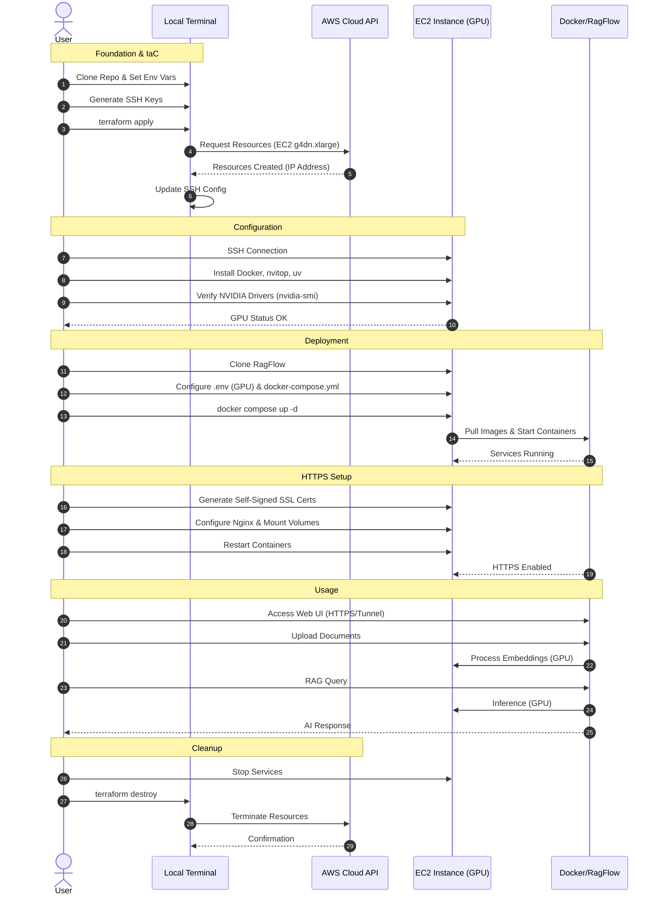
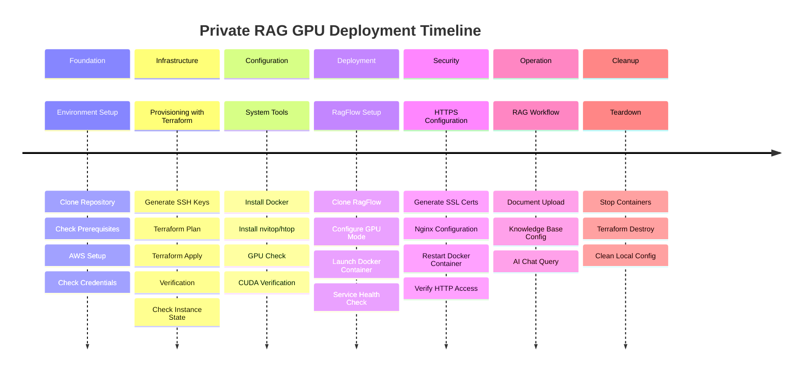
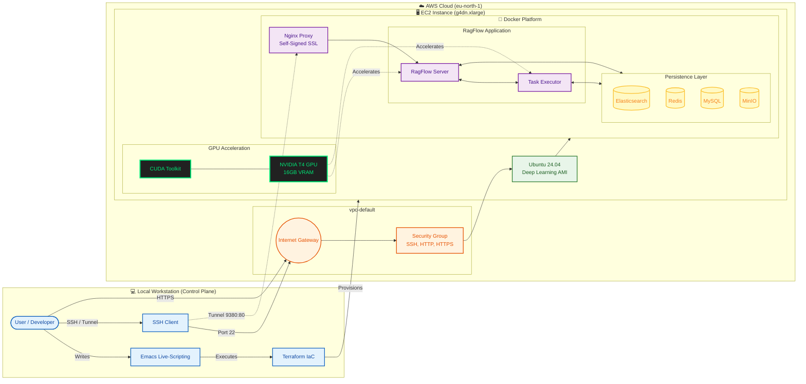

# Private RAG AWS GPU Deployment Diagrams

Based on `private-rag-aws-gpu.org`, the following diagrams illustrate the architecture, workflow, interaction sequence, and project timeline for the Private RAG GPU deployment.

## 1. System Architecture

This diagram illustrates the AWS infrastructure and the software stack running on the GPU-enabled EC2 instance.

## Legend

```mermaid
graph LR
    %% Styles
    classDef user fill:#FFE4B5,stroke:#FFA500,stroke-width:3px,color:black;
    classDef cloud fill:#B1CFFC,stroke:#87CEEB,stroke-width:3px,color:darkblue;
    classDef infrastructure fill:#DFF5D0,stroke:#A3E278,stroke-width:3px,color:black;
    classDef hardware fill:#F5F5F5,stroke:darkgray,stroke-width:3px,color:black;
    classDef software fill:#E6E6FA,stroke:#DDA0DD,stroke-width:3px,color:black;
    classDef container fill:#FFB6C1,stroke:#FF69B4,stroke-width:3px,color:black;
    classDef security fill:#FFFACD,stroke:#FFD700,stroke-width:3px,color:black;

    subgraph Legend ["Legend"]
        UserLegend(["User/Developer"])
        CloudLegend(["Cloud Infrastructure"])
        InfraLegend(["Server Infrastructure"])
        HardwareLegend(["Hardware Components"])
        SoftwareLegend(["Software Stack"])
        ContainerLegend(["Containers"])
        SecurityLegend(["Security"])
    end

    %% Legend styling
    class UserLegend user;
    class CloudLegend cloud;
    class InfraLegend infrastructure;
    class HardwareLegend hardware;
    class SoftwareLegend software;
    class ContainerLegend container;
    class SecurityLegend security;
```

## 2. Deployment Flowchart

This flowchart shows the high-level process from environment setup to infrastructure cleanup.

## 3. Sequence Diagram

This diagram shows the interactions between the user, the local environment, AWS, and the deployed instance.

## 4. Project Timeline

This timeline visualizes the phases of the deployment project.

# RagFlow AWS GPU Deployment Architecture

## Architecture Components Overview

### Infrastructure Layer
- **AWS EC2 GPU Instance**: `g4dn.xlarge` providing a balance of compute and GPU performance.
- **Deep Learning AMI**: Ubuntu 24.04 pre-configured with NVIDIA drivers and CUDA, eliminating manual setup.
- **Networking**: Default VPC in `eu-north-1` with Security Groups allowing SSH (22), HTTP (80), and HTTPS (443).

### Container Platform
- **Docker Engine**: Runtime for containerized applications, configured with `nvidia-container-toolkit`.
- **RagFlow Stack**:
    - **Nginx**: Handles reverse proxying and SSL termination (Self-Signed).
    - **RagFlow Server**: Core application logic.
    - **Task Executor**: Handles background jobs like document parsing.
    - **Databases**: Elasticsearch (Vector DB), Redis (Caching), MySQL (Metadata), MinIO (Object Storage).

### GPU Acceleration
- **NVIDIA T4**: 16GB VRAM GPU dedicated to accelerating embeddings generation and vector search operations.
- **CUDA Integration**: Passed through to Docker containers via the `gpu` profile.

### Development Workflow
- **Live-Scripting**: The entire infrastructure and deployment is managed via executable code blocks in Emacs.
- **Terraform**: Infrastructure as Code (IaC) ensures reproducible environment creation and destruction.